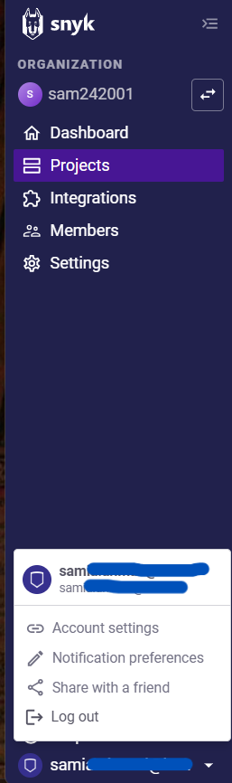
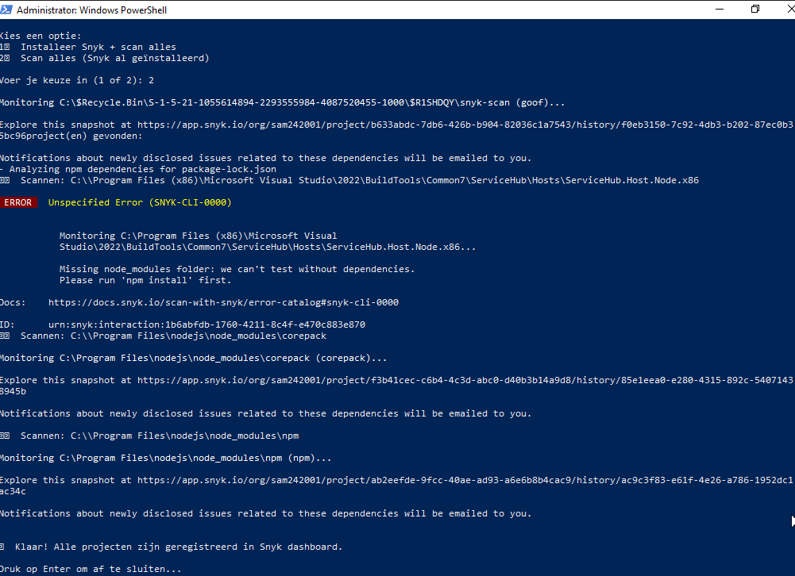
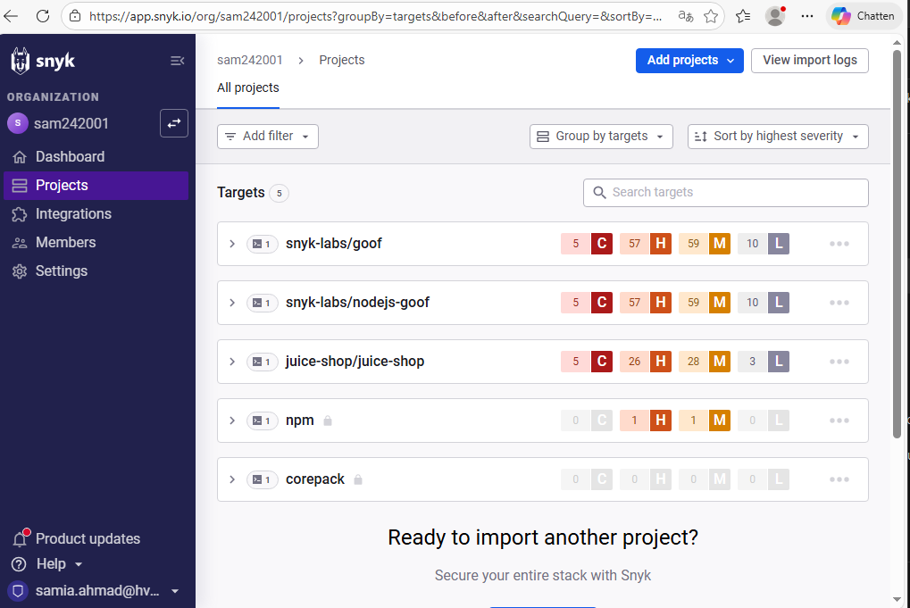
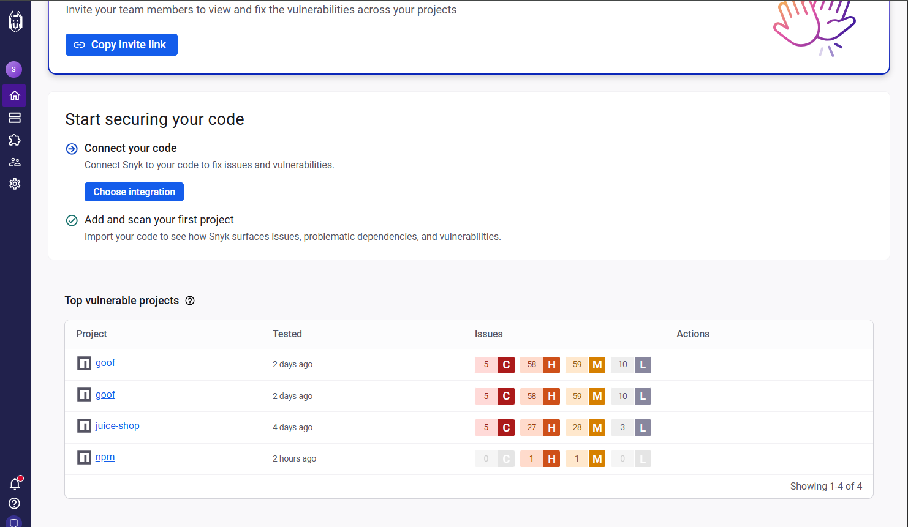
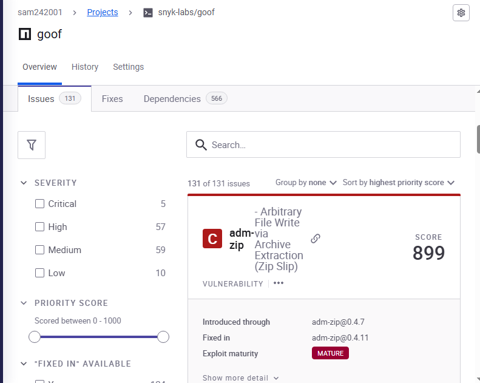
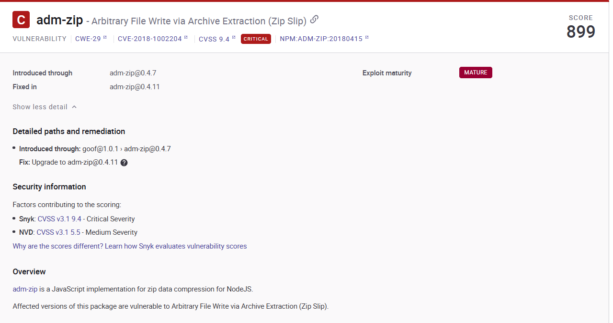

Volg dit stappenplan nadat je eerst de vereisten in 'Requirements.md' hebt uitgevoerd.

Dit stappenplan beschrijft hoe het Python script de Snyk tool installeert, koppelt en hoe scans worden uitgevoerd.

## Stap 1: Snyk API token ophalen

1. Ga naar:

- https://app.snyk.io/login en log in op je Snyk account.

2. Ga naar:

- Account Settings -> Auth Token

3. Kopieer je token en bewaar deze tijdelijk (nodig voor authenticatie)

## Stap 2: Python Script uitvoeren

Open PowerShell als Administrator en voer het Python script uit met het volgende commando:

**python [/pad/naar/script/]snyk_installer.py --token <JOUW_TOKEN>**

**Let op:** Het script moet worden uitgevoerd vanuit een map op de schijf waar je schrijfrechten hebt als Administrator. Open daarom Powershell als Administrator voordat je het script start.

Het script geeft twee opties:

1. Het installeren van Snyk tool en scan uit voeren

.png)

.png)

2. Scan uitvoeren nadat Snyk al geïnstalleerd is

Het script voert automatisch uit:

- Installatie van Snyk tool
- Verifiëren van verbinding met je Snyk account
- Scannen van kwetsbaarheden
- Tonen van kwetsbaarheden in Dashboard

## Stap 3: Resultaten bekijken in Dashboard

1. Ga naar je Snyk account
2. Open het aangemaakte project

3. Hier zie je:
   - Kwetsbaarheden
   - Severity (Low / Medium / High / Critical)
   - Versiebeheer van risico's
   - Waar het risico plaatsvindt
   - Mogelijke fixes (oplossingen)
 

